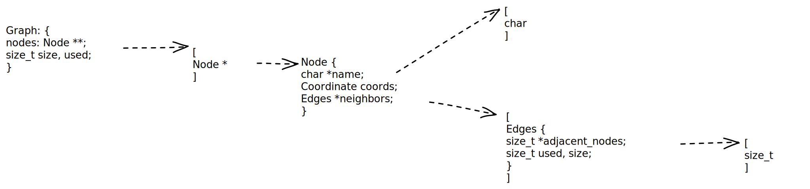

## Input files

The input file which the nodes are read from should be a csv and it should look like this:

```
// name; x coordinate; y coordinate

A;10;10
B;-10;2
C;-20;-20
```

## Data structure



This is going to be a directional graph

## I have a bug when i read a file and there is whitespace at the end of the line the last edge doesnt get read in
