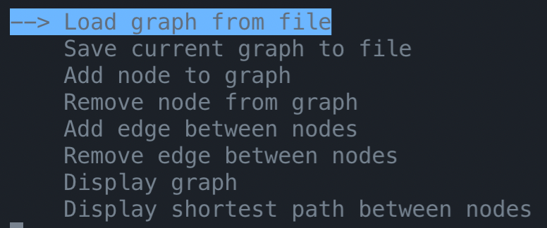

# Felhasználói dokumentáció

## A menü

A program indításakor egy ilyen menü kell, hogy megjelenjen a konzolon magunk előtt.



Itt ki tudjuk választani, hogy éppen mit szeretnénk csinálni.
A fel/le nyilakkal tudunk mozogni és az `enter` billentyű lenyomásával tudjuk kiválasztani az adott feladatot.

## Gráf betöltése fájlból _`(Load graph from file)`_

Ebben az almenüben a program egy csv fájl elérési útvonalát kéri tőlünk.
Amelyből majd beolvassa a gráfot.
Ha a program valamilyen hiba okán nem tudja beolvasni a fájlt akkor kiír egy hibaüzenetet majd kilép.
Ha a fájlt be tudja olvasni, de nem megfelelő a gráf formátuma benne akkor ugyancsak kiír egy hibaüzenetet majd kilép.

A program ilyen típusú csv fájlokat tud beolvasni:

```csv
csúcs neve;x koordináta;y koordináta;"az adott csúcshoz tartozó szomszédok neve vesszővel elválasztva"
```

Egy helyes példa fájl:

```csv
A;-279;-215;"H,G,C"
E;430;334;"C"
H;-40;320;""
F;-252;278;"E,I,J"
G;503;-280;""
J;-81;-162;"F"
I;264;243;"C,H"
B;-176;-143;"A,D"
C;425;-298;"A,D"
D;-537;288;"I,B,C"
```

A csúcsok koordinátái csak egy bizonyos intervallum között lehetnek ezt az SDL ablak mérete határozza meg de a program ellenőrzi ezt is.
Miután a program helyesen beolvasta a fájlt kiírja, hogy hány csúcsot olvasott be majd visszalép a fő menübe.

## Gráf mentése fájlba _`(Save current graph to file)`_

Ebben az almenüben a program egy csv fájl elérési útvonalát kéri tőlünk,
amelybe majd elmenti a gráfot.

Ugyan úgy, mint a beolvasásnál, ha a program nem tudja elmenteni a fájlt akkor kiírja a hiba okát és kilép.
A program egy olyan fájlba fogja elmenteni a gráfot, amelyet a beolvasásnál specifikáltunk.

A gráf sikeres mentése után a program visszalép a fő menübe.

## Csúcs hozzáadása _`(Add node to graph)`_

Ebben az almenüben a program egy új csúcsot fog hozzáadni a gráfhoz _(meglepő?)_.

Itt a program először kérni foglya tőlünk a csúcs nevét, ami maximum 20 karakteres lehet _(5 alatt kellene tartani mert különben az SDL ablakban elég csúnyán fog kinézni)_
Majd, ha ezt megtettük akkor a csúcs koordinátáit kell beírnunk `x,y` formátumban, ha nem írunk be semmit akkor a `0,0` koordinátát állítjuk be a csúcsnak.

## Csúcs törlése _`(Remove node from graph)`_

Ebben az almenüben a program egy csúcsot fog kitörölni a gráfból.

Itt a program csak egy csúcs nevét kéri. Majd a beolvasott név alapján azonosítja a csúcsot majd kitörli a gráfból.
Ha nem találja a csúcsot akkor feltételezi, hogy a felhasználó rosszul írta be a nevét és újra megkérdezi a felhasználótól azt, ezt addig csinálja amíg nincs egy csúcs, amit be tud azonosítani.

Ha a gráf üres akkor kiírja, hogy nincs csúcs, amit ki tudnánk törölni.

## Él hozzáadása _`(Add edge between nodes)`_

Ebben az almenüben a program egy élt fog hozzáadni a gráfhoz.

Itt a program két csúcs nevét fogja kérni úgy ahogy az előbbiekben.
Majd megkérdezi a felhasználótól, hogy az él egy irányú lesz e.
Ha a felhasználó `yes`-t ír be akkor a gráfhoz úgy adódik hozzá az él hogy az csak az első csúcsból megy a másodikba, különben az él mindkét irányba menni fog.

A sikeres hozzáadás után a program visszamegy a fő menübe.

## Él törlése _`(Remove edge between nodes)`_

Ebben az almenüben a program egy élt fog törölni a gráfból.

Itt a program két csúcs nevét fogja kérni úgy ahogy az előbbiekben.
Majd megkérdezi a felhasználótól, hogy az élt mindkét irányba törölje e.
Ha a felhasználó `no`-t ír be akkor az él csak az egyik irányba fog törlődni, különben az él mindkét irányba törlődni fog.

A sikeres törlés után a program vissza megy a fő menübe.

## Gráf kirajzolása _`(Display graph)`_

Ebben az almenüben a program nyitni fog egy SDL ablakot majd abban egy animációval kirajzolja a gráfot.
Hogy ha újra akarjuk, hogy kezdje az animációt akkor az `r` betű megnyomásával ezt megtehetjük.
Az SDL ablak bezárásával vissza tudunk menni a fő menübe.

## Két csúcs közötti legrövidebb útvonal kirajzolása _`(Display shortest path between nodes)`_

Ebben az almenüben a program kérni fog tőlünk két csúcsot ahogy az előbbiekben is. Majd a program megnézi, hogy el lehet e jutni az első csúcsból a másodikba, ha nem akkor a program kiírja, hogy nincs útvonal a két csúcs között majd visszalép a főmenübe, ha viszont létezik útvonal, akkor a program nyitni fog egy SDL ablakot majd abban egy animációval kiemeli a legrövidebb utat a két csúcs között.

Hogy ha újra akarjuk, hogy kezdje az animációt akkor az `r` betű megnyomásával ezt megtehetjük.

Az SDL ablak bezárásával vissza tudunk menni a fő menübe.

# NAGYON FONTOS!

A program feltételezi, hogy a csúcsok neve mind egyedi, de nem ellenőrzi, viszont ez egy szükséges feltétele a program működésének.
